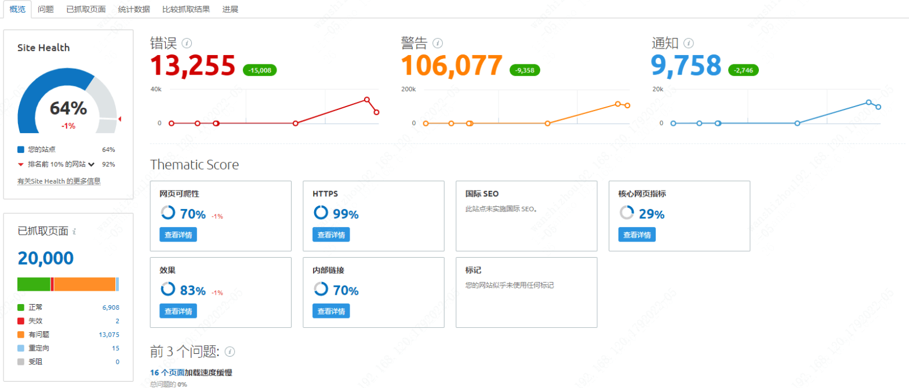
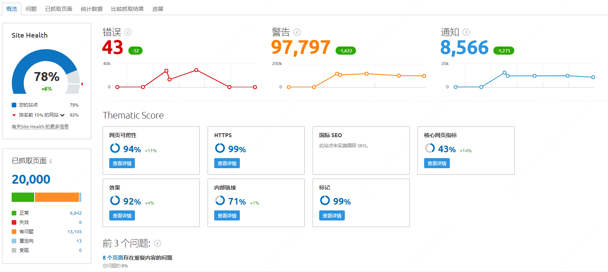
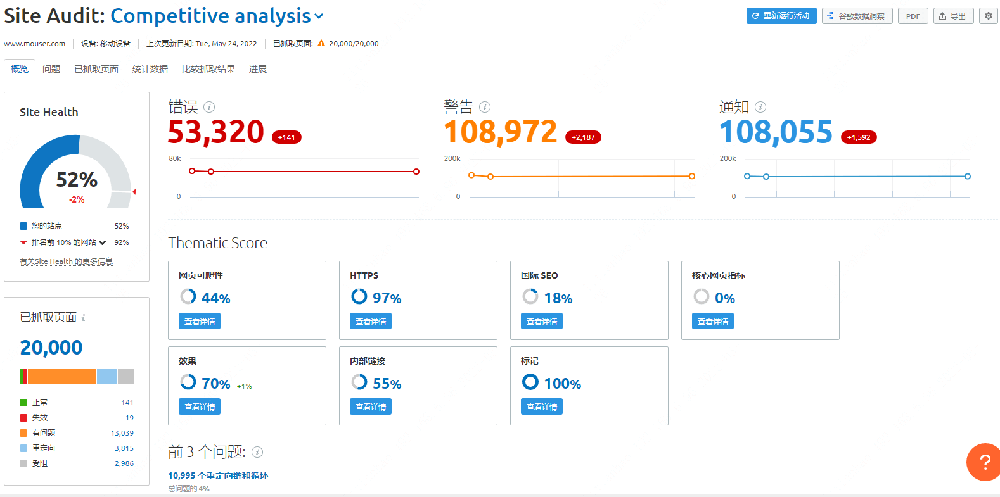

# SEO优化

## 结果统计对比
工具: `SEMRUSH` (付费)

- 优化前: 
- 优化后: 
- 竞争对手(mouser): 

**总体提升了14%，超出竞争对手26%。**仍然遗留了些许问题，由于项目在重构，后续优化将在重构后的站点上进行。

[google search seo doc](https://developers.google.com/search/docs/basics/get-started)

## seo优化历程

### 语义化标签
- `<title>`: 网页主题
- `<header>`: 页眉
- `<footer>`: 页尾
- `<nav>`: 导航
- `<aside>`: 侧边栏
- `<main>`: 网页主体
- `<article>`: 定义外部的内容，其中的内容独立于文档的其余部分
- `<section>`: 定义文档中的区。
- `<hn>`: 标题
- `<ul>`: 无序列表
- `<ol>`: 有序列表
- `<strong>`: 强调文本，粗体
- `<small>`: 呈现小号字体效果，输入免责声明、注解、署名、版权。
- `<em>`: 强调文本，斜体
- `<mark>`: 黄色文本，一般用于关键词搜索后标记搜索内容。

需要注意的是：
- 不要因为`strong em`等标签的样式去使用，`html`应关注内容和语义，样式交给`css`
- `<hn>`中`<h1>`的权重最高，但是一个页面尽可能只出现一次，放置网页中最重要的信息，滥用会降低搜索引擎中的权重比例。
- `<h2> ~ <h6>`虽然可以多次使用，但是需要安排好结构，例如：`<h3>`应该是`<h2>`的子标题，不能反过来。

### 站点地图 `sitemap.xml`
在搜索引擎上传，以便允许其抓取`Sitemap`提供的所有网址，并了解使用相关元数据的网址。使用`Sitemap`协议并不能保证网页会包含在搜索引擎中，但可向网络抓取工具提供一些提示以便它们更有效地抓取网站。示例：
``` html
<?xml version="1.0" encoding="UTF-8"?>
<urlset
  xmlns="http://www.sitemaps.org/schemas/sitemap/0.9"
  xmlns:xsi="http://www.w3.org/2001/XMLSchema-instance"
  xsi:schemaLocation="http://www.sitemaps.org/schemas/sitemap/0.9
        http://www.sitemaps.org/schemas/sitemap/0.9/sitemap.xsd">
  <url>
    <loc>https://www.lcsc.com/</loc>
    <lastmod>2022-03-21T03:32:32+00:00</lastmod>
    <priority>1.00</priority>
  </url>
</urlset>
```

### 字体加载`font-display`

`css`中使用`font-display: swap;`，字体文件未加载前显示系统字体，加载完后切换为web字体。

### 网页`TDK`
- `title`: 50字左右
- `keyword`: 
- `description` 150字左右

根据首页，分类页，产品页做不同的设计。

**动态参数网页可以加料唯一值，例如商品编号，以防重复信息而降低评分**

### 结构化数据 
结构化数据是网页中一段固定格式的字符串，是个网页内容的元数据。搜索引擎通过结构化数据可以更好的理解页面内容，在搜索结果中，以富媒体方式展示搜索内容。
使用方式：
``` html
  <head>
    <title>Executive Anvil</title>
    <script type="application/ld+json">
    {
      "@context": "https://schema.org/",
      "@type": "Product",
      ...
    }
    </script>
  </head>
```
具体配置见文档 [google search seo doc](https://developers.google.com/search/docs/basics/get-started)

### ``标签添加`alt`属性
`Alternative text`（替代文本），是HTML代码中用于描述页面上图像外观的介绍。
- 提高页面页面内容的可读性
- 提高页面主关键词相关度
- 可以在`Google Image`里面增加曝光和展示
- `Google`将`Alt`视为图片锚文本，谷歌通过锚文本内容去理解链接到的页面内容
- 给图片定义`width`和`height`可以有效提升性能

### `<a>`标签添加`rel="nofollow"`
告诉搜索引擎，不要追踪此网页上的链接。一般用于：
- 屏蔽站点不重要链接，例如广告等等。
- 不可信赖的用户进行的评论、留言。

### `rel="canonical"`
为类似网页或重复网页指定权威网页。目的：
- 指定您希望用户在搜索结果中看到的网址
- 整合类似网页或重复网页的链接信号
- 避免花费时间抓取重复网页

### 简单的网址结构
1.使用简单、说明性字词；避免不易读的、冗长的 ID 编号。
  - <span style="color: #34a853">*/coffee/latte</span>
  - <span style="color: #dd2c00">*/index.php?id_sezione=360&sid=3a5ebc944f41daa6f849f730f1</span>

2.网址中的关键字用连字符分隔开
  - <span style="color: #34a853">*/green-dress</span>
  - <span style="color: #dd2c00">*/greendress</span>

3.使用连接线 `-`，避免使用下划线 `_`
  - <span style="color: #34a853">*/summer-clothing/filter?color=dark-grey</span>
  - <span style="color: #dd2c00">*/summer_clothing/filter?color=dark_grey</span>

### 确认链接可抓取
- 建议
  - `<a href="https://example.com">`
  - `<a href="/relative/path/file">`

- 不建议
  - `<a routerLink="some/path">`
  - `<a onclick="goto('https://example.com')">`