## 团队开发GIT分支管理

## 注意事项
- `feature` 分支命名格式：`需求编号+日期+责任人，例：PRM8517-0520-XXX`
- `master` 分支增加保护。
- 合并至 `uat` 前必须先合并 `fat`。
- 合并至 `develop` 前必须先合并 `uat` 和 `fat`。

## 其余事项
- 如果不小心直接在 `fat uat` 分支上提交了代码并已推送，不用直接到其他分支上修改，合适的方案是 `cherry-pick` 到对应的开发分支。
- 如果不小心在 `develop` 修改了代码。
  - 未 `commit`，则 `stash` 代码，切换 `feature` 分支并 `pop stash`。
  - 已 `commit` 未 `push`，删除分支，从远端重新拉取。
  - 已 `commit` 和 `push`，通知负责人，回退代码，并强推到远端，其余所有人重新拉取。
